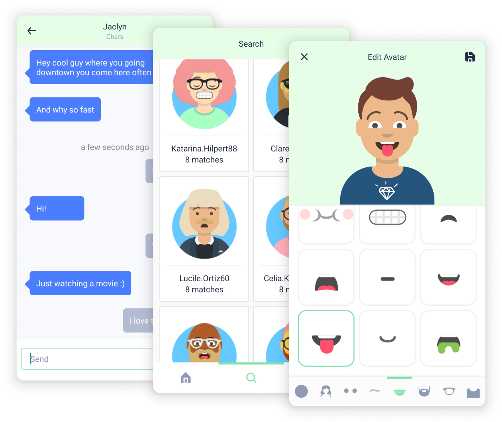

Agori is an interest based friendship app.

Users can subscribe to interests that allow them to find and chat with other people they may get along with. Users can create avatars using an avatar customizer to easily express themselves.

## Tech Stack

Agori tries to keep typesafe code, while still maintaining readability and scalability. It's primary language is Typescript.

The frontend is written with React Native using Kitten UI's components and Apollo's GraphQL client.

The backend uses TypeGraphQL, a typescript friendly GraphQL framework, along with Apollo server on top of Koa.

Objection.js is used as an ORM (more of a query builder) to model PostgreSQL data and queries in typescript.

Jest is used for testing. Hygen for generating new code.

Authentication is managed externally by Keycloak. The API will dynamically create new users in the database whenever a new authenticated JWT makes its first request. This simplifies the scope of the project without sacrificing features while offloading risks to an already hardened solution.

## Development

The development environment is containerized and managed with Docker Compose. A single Dockerfile can target production or development images. Development images are designed to allow for mounting code to enable live reload and quick iteration. A test postgres database is used to keep testing and development as close to the production environment as possible.
