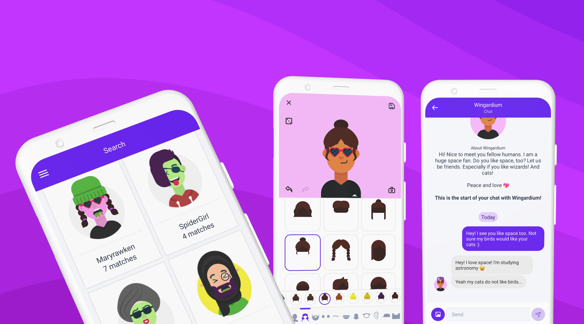

Agori is an interest based friendship app.

Users can subscribe to interests that allow them to find and chat with other people they may get along with. Users can create avatars using an avatar customizer to easily express themselves.

## Avatars

One of the core features to Agori is it's avatar designer. Users can pick and choose from several features, colors, and variations to create a personal avatar that is used for themselves through the app. Avatars are SVG based and use multiple SVG features to allow as much flexibility as possible. When you think about transparencies, clipping, hats, glasses, etc, there's a lot of consideration that goes into how to compose an avatar from individual parts.

The asset pipeline for the avatars has several steps, using automation whereever possible. It takes assets from Adobe Illustrator, optimization, organization through Figma, a color coding process, and code generation to crossplatform SVG React components.

Special attention had to go to the performance in the avatar editing area of the app. SVGs aren't as easy to use in React Native as they are on the web. Miniature displays of each avatar component in every color and variation are prerendered as appropriately sized PNG's. This helps keep the rendering overhead down.

## Tech Stack

Agori tries to keep typesafe code, while still maintaining readability and scalability. It's primary language is Typescript.

The frontend is written with React Native using Kitten UI's components and Apollo's GraphQL client.

The backend uses TypeGraphQL, a typescript friendly GraphQL framework, along with Apollo server on top of Koa.

Objection.js is used as an ORM (more of a query builder) to model PostgreSQL data and queries in typescript.

Jest is used for testing. Hygen for generating new code.

## Development and Deployment

Agori's various development to production environments are managed by [Nix](https://nixos.org/). External services are hosted locally with Docker Compose during development. Agori is containerized (based on the same Nix configuration from the development environment!) and deployed on the Google Cloud Platform.

> Note: The linked code is an early open source version of Agori
