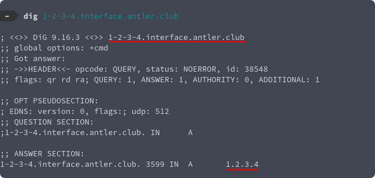

> Part of the [Virtual Browser Project](/virtual-browser)

For the virtual browser project I decided to avoid using a load balancer for the dynamic interface servers. I did this to keep my costs as low as possible, because it seemed complicated, and also because once I started thinking about it I thought it’d be interesting to do. [Source code](https://github.com/aldrio/passthrough-dns).

The problem with skipping a load balancer is that when using https, you can’t create an unencrypted WebSocket to a random IP. Browsers don’t like this. I don’t want to generate SSL certs on the fly, and I’d also have to add a DNS record for each new interface and it's another point of failure to set up error handling for in case the provision doesn’t go through correctly. So somehow we have to get a valid SSL certificate knowing only the IP address.

My solution to this “problem” ([inspired by Plex](https://blog.filippo.io/how-plex-is-doing-https-for-all-its-users/)) was to create a DNS server that allows for encoding an IP address in a subdomain. So, if I request an A record for `0-0-0-0.interface.antler.club` it’ll resolve to the IP address `0.0.0.0`. (You can even try this yourself with the dig command) This simple solution allowed me to create a wildcard certificate for `*.interface.antler.club` that’s used on every interface server, and now users’ traffic can go directly there, encrypted.

