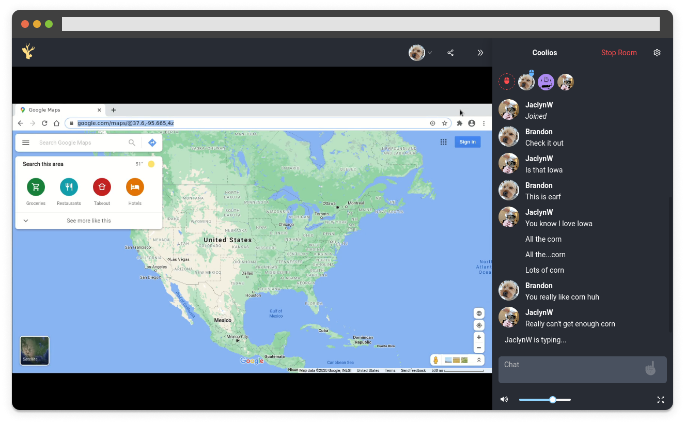

Antler Club is a website I created for sharing a virtual instance of a web browser. You start a room, get a link to share, and then you and your guests will be presented with a synchronized web browser. The best way to demonstrate this is by showing a screenshot:

As you can see, there’s a chat, some controls, and the browser itself. It’s a website for doing things such as looking at google maps or watching youtube videos. It’s a lot like screen sharing but more like being together in person where anybody can grab the mouse and keyboard.

## The Requirements

There are a few primary requirements that I defined for this website. Multiple rooms need to be able to run at a time. The backend has to scale to meet demands. There had to be a chat. Every participant has to be able to control the browser. It must work even if the owner of the room leaves.

## The Challenges

This is a unique website and with that comes unique challenges. Here are some key challenges and the decisions surrounding them:

### What’s the best way to sync arbitrary web content between multiple users?

It’s not enough to just use an iframe and pipe events like page changes and keypresses between peers. That wouldn't be secure and it would be hard to guarantee multiple people were seeing the same thing.

It seems the best answer to this question is to have one trusted master browser that multiple people control. We can send the clients' mouse and keyboard actions to the trusted browser and stream a video of it to every user.

### How do we stream the "master browser"?

When using a streamed video of a central browser, we need the latency to be as low as possible. By this I mean that when you move your mouse and click on things, the video needs to respond very quickly. Anything over, say, a second would be difficult and confusing to use.

So we can capture the virtual screen and transcode the video with gstreamer using options that favor low latency. But then what's the best way to actually stream it?

One option would be HLS. If you search low latency streaming, it’s one of the top results. But HLS has a lower bound of around 2 seconds. That’s too much. A lower latency consideration is sending the video straight through a WebSocket. But media streaming isn’t exactly what WebSockets are designed for.

In the end, the best choice is WebRTC. WebRTC is a protocol designed for real-time communications like voice and video calls, which share our latency constraints. WebRTC is traditionally peer-to-peer, but we don’t really need this to be a peer-to-peer app. We’ll just think of our master browser as one peer and each client as another (the Selective Forwarding Unit pattern in WebRTC terms).

### How do we run the “master browser”?

One good idea, and an approach I fully implemented, is to set up a virtual machine with a kiosk flavored linux distro running only chrome. It’s secure, it’s easy to run more than one per host, and it’s highly configurable. On paper it’s a good idea, but in practice there were two problems. For one, it was too resource intensive. The video was laggy. The virtual video drivers couldn’t keep up and it resulted in screen tearing. The second issue was that a virtual machine was too iffy of a dependency. If we’re running this server on a VPS that’s _already_ virtualized then we rely on the VPS provider having a certain setup to ensure we can go that second level deeper, which it turns out isn’t very common.

The next approach was to use Docker. We can run chrome in it securely, docker containers can run independently of each other, and it’s just as configurable. Docker runs at near native performance, and we can run it even when our environment is on a VPS. Docker is an ideal choice for this application.

## Architecture

There’s three primary components to the virtual browser setup and by now I’ve explained the challenges and their solutions in enough detail that the architecture is becoming clear.

### Interface

The interface component hosts the rooms and controls the virtual browsers. One interface runs per physical server, and each interface can be hosting more than one room at a time. Interfaces can be configured to have a capacity and they can be cordoned for maintenance. Interfaces keep track of Docker containers for corresponding rooms, stream videos of the screen to each user, and act as a control proxy from the user to the browser. Inside the Docker container alongside the browser process is gstreamer recording the screen and encoding the video for transmission.

### API

The API component handles all administrative tasks that don’t directly involve a virtual browser, like room management and payment processing. While the API doesn’t control the virtual browsers directly, it does control the interfaces. When a room has had no viewers for some time, the API tells the interface to turn it off, freeing up space for another room. When the current interfaces are all being used up past some threshold the API will schedule a configured VPS provider’s API to start up a new interface server.

### Webapp

The final component is the webapp, which is the user's way of controlling all of this. The webapp is pretty self explanatory. It’s compatible with desktop or mobile and has controls to create a subscription to a room, start a room, stop a room, etc. When you view a live room on the webapp, you see a video of the virtual browser and it reacts to your controls. It also has a chat and user list for all participants and controls to change user’s permissions.

## Conclusion

This virtual browser website has been challenging and rewarding to create. There’s so many details that couldn’t fit in this writeup. I currently still work on it every few days, but at this point it definitely fulfills all of its requirements very well. I’ve learned a lot with this project, and I think after working on it I’ve grown much better at planning and structuring complicated applications.

### Relevant

- [Antler Club](https://antler.club)
- A topic about that didn't fit in with the rest of the writeup: [Avoiding a Load Balancer](/virtual-browser/avoiding-a-load-balancer)
